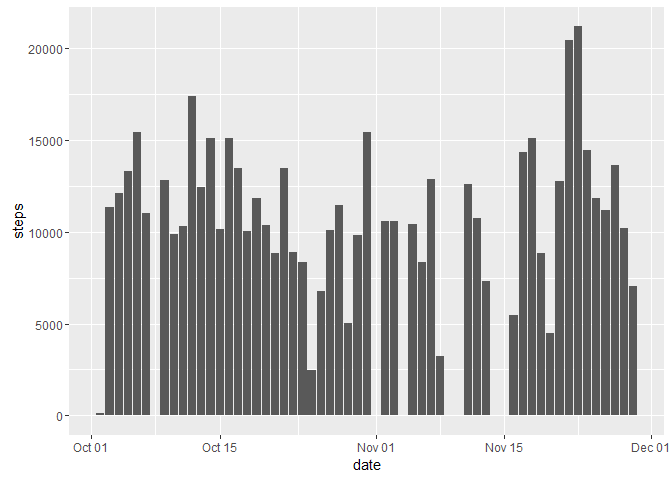

# Reproducible Research: Peer Assessment 1


## Loading and preprocessing the data

```r
# unzip the file and read the activity data
activityData <- read.table(unz("activity.zip", "activity.csv"), header=T, quote="\"", sep=",")
# format the date column to a Date type
activityData$date <- as.Date(activityData$date)
```

## What is mean total number of steps taken per day?

```r
library(ggplot2)
# Aggregate the data taking the sum of the steps by date and then plot in a bar plot
dailyActivityData <- setNames(aggregate(activityData[,1], by=list(date = activityData[,2]),FUN=sum), c("date", "steps"))
ggplot(data = dailyActivityData, aes(date, steps)) + geom_bar(stat = "identity")
```

```
## Warning: Removed 8 rows containing missing values (position_stack).
```

<!-- -->


Average number of steps per day 10766.19  
Median number of steps per day 10765

## What is the average daily activity pattern?

```r
# get the 5 mniute intervals and average across all days
intervals = unique(activityData$interval)
# just get the average number of steps by the interval and plot
intervalActivityData <- tapply(activityData$steps, activityData$interval, mean, na.rm = TRUE)
plot(x = intervals, y = intervalActivityData, type = "l", xlab = "Intervals", ylab="Steps", main="Average Steps Per 5 Minute Interval", col="blue")
```

<!-- -->

```r
# determine which interval has the maximum number of steps
maxInterval <- which.max(intervalActivityData) 
maxIntervalName <- intervals[maxInterval]
```
The interval with the maximum number of average steps is 835 

## Imputing missing values

```r
# use the mean interval data to impute the missing data values
intervalActivityData <- as.vector(intervalActivityData)
imputedActivityData <- activityData
# find out which values are NA and use the index values
missingDataIndex <- which(is.na(imputedActivityData$steps),  arr.ind=TRUE)
# step through each missingIndex and use the intervals array to get the average computed intervals for that interval
for (i in 1:length(missingDataIndex))
{
  interval <- imputedActivityData[missingDataIndex[i], 3]
  imputedActivityData[missingDataIndex[i], 1] <- intervalActivityData[which(intervals==interval)]
}
# Now we can aggregate the total steps by the date
imputedDailyActivityData <- setNames(aggregate(imputedActivityData[,1], 
                                     by=list(date = imputedActivityData[,2]),FUN=sum), 
                                     c("date", "steps"))
ggplot(data = imputedDailyActivityData, aes(date, steps)) + geom_bar(stat = "identity")
```

<!-- -->

```r
avgImputedSteps <- format(mean(imputedDailyActivityData$steps, na.rm = T), digits=2, nsmall=2)
medianImputedSteps <- format(median(imputedDailyActivityData$steps, na.rm = T), digits=2, nsmall=2)
```
Average number of steps per day with imputed data 10766.19  
Median number of steps per day with imputed data 10766.19  
The impact of imputing the values using the average interval values is that the median and mean are equal now.

## Are there differences in activity patterns between weekdays and weekends?

```r
# add column for wekday factor variable
weekend <- c("Saturday", "Sunday")
imputedActivityData$weekday <- factor((weekdays(imputedActivityData$date) %in% weekend), 
         levels=c(TRUE, FALSE), labels=c('weekday', 'weekend'))
# aggregate the average steps by the intervals and weekday
imputedWeekdayActivityData <- aggregate(steps ~ interval + weekday, imputedActivityData, mean)
library(lattice)
xyplot(imputedWeekdayActivityData$steps ~ imputedWeekdayActivityData$interval | imputedWeekdayActivityData$weekday, main="Average Steps Per 5 Minute Interval", xlab="Interval", ylab="Steps", layout=c(1,2), type="l")
```

<!-- -->
